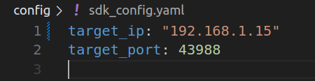

## 🦿 MC_SDK 使用指南
### 📂 目录结构
```bash
MC_SDK/
│── .vscode/               # VSCode 配置文件
│── build/                 # 编译文件目录
│── demo/                  # demo
│   │── cpp/               # cpp demo
│   │── python             # python
│── include/               # 头文件
│   │── highlevel_demo.cpp # 高级控制示例
│   │── lowlevel_demo.cpp  # 低级控制示例
│── .gitignore             # Git 忽略文件
│── CMakeLists.txt         # CMake 构建文件
│── image_1.jbg            # 机器人关节坐标系示意图
│── image.png              # ip配置示意图
│── README.md              # 说明文档
```

### 1. mc_sdk CPP 使用

**📌 依赖环境**
- Ubuntu 22.04
- CMake 3.8+
- GCC 11+
- Eigen3

- 基于 cmake 使用 mc_sdk
```cmake
find_library(MC_SDK_LIB mc_sdk_${CMAKE_HOST_SYSTEM_PROCESSOR}
    PATHS 
        ${CMAKE_SOURCE_DIR}/../../lib
    REQUIRED
)

add_executable(highlevel_demo highlevel_demo.cpp)
target_link_libraries(highlevel_demo ${MC_SDK_LIB})
target_include_directories(highlevel_demo PRIVATE ${CMAKE_SOURCE_DIR}/../../include)

add_executable(lowlevel_demo lowlevel_demo.cpp)
target_link_libraries(lowlevel_demo ${MC_SDK_LIB})
target_include_directories(lowlevel_demo PRIVATE ${CMAKE_SOURCE_DIR}/../../include)

```
**🔧 编译**
```bash
mkdir build && cd build
cmake ..
make
```
**🚀 运行示例**
```bash
# 运行高级控制示例
./highlevel_demo

# 运行低级控制示例
./lowlevel_demo
```


### 2. mc_sdk_py 使用

- 使用 python 接口
导入路径 
```bash
import sys
import os
sys.path.append(os.path.abspath(os.path.join(os.path.dirname(__file__), "../../../"))) # 包含 py_whl文件夹路径

```
```python
from py_whl import mc_sdk_py
import time

app=mc_sdk_py.HighLevel()
app.initRobot("127.0.0.1",43988) # local_ip, local_port, dog_ip default 192.168.234.1
app.standUp()
time.sleep(2)
while True:
    app.jump()
    time.sleep(2)
```

### 🌍 3. 网络配置
机器人ip: 192.168.234.1

### 🖥️ 配置本地 IP 和端口
在代码中修改 CLIENT_IP、CLIENT_PORT和DOG_IP：

示例：
```c++
constexpr int CLIENT_PORT = 43988;      // 本地端口  
std::string CLIENT_IP = "192.168.234.15"; // 本地 IP 地址
// 机器人ip默认192.168.234.1，如果需要更改机器人IP可通过init_robot()接口传入更改后的机器人ip
```

### 🤖 在机器人端配置本地 IP 和端口
编辑配置文件： 📌 路径： /opt/export/config/sdk_config.yaml

配置示例：
  
```yaml
  target_ip: "192.168.234.15"
  target_port: 43988
```
**⚠️ 请确保机器人 IP 和端口号匹配，否则无法建立通信。**

### 🎮 4. 关节控制命令说明
**📌 命令顺序**
- FR（右前）
- FL（左前）
- RR（右后）
- RL（左后）

#### 🔄 关节方向定义
A,H,K关节坐标系 前X， 左Y， 上Z


#### 🔧 控制参数

```c++
关节角度指令
float q_des_abad[4] // A 关节角度指令
float q_des_hip[4]  // H 关节角度指令
float q_des_knee[4] // K 关节角度指令

关节角速度指令
float qd_des_abad[4]  // A 关节角速度指令
float qd_des_hip[4]  // H 关节角速度指令
float qd_des_knee[4] // K 关节角速度指令

关节 PID 参数
float kp_abad[4]  // A 关节 Kp
float kp_hip[4]   // H 关节 Kp
float kp_knee[4] // K 关节 Kp

float kd_abad[4]  // A 关节 Kd
float kd_hip[4]   // H 关节 Kd
float kd_knee[4]  // K 关节 Kd

关节扭矩指令
float tau_abad_ff[4]  // A 关节扭矩指令
float tau_hip_ff[4]   // H 关节扭矩指令
float tau_knee_ff[4]  // K 关节扭矩指令
```

